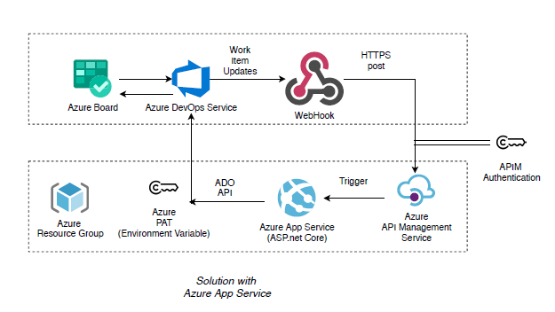

# Azure Boards - Automate State Transitions

This project was created to help automate the updating of parent state transitions depending on the state of the child work items.

This API receives an Azure Boards work item update web hook event. The API will load the work item, check against a series of rules, and update it's parent work item accordingly.

For example, if your User Story is New and you create a task and set that task to active, the User Story should automatically be set to Active.

## Important Updates (for this forked repo)
* This forked repo is enhancing the original repo from MSFT and another forked repo of another github user mstephano (courtesy [this repo](https://github.com/mstephano/azure-boards-automate-state-transitions))

# Setup

1. Create a new Azure DevOps [Personal Access Token](https://docs.microsoft.com/en-us/azure/devops/organizations/accounts/use-personal-access-tokens-to-authenticate)

2. `Deprecated  due to security concerns of including the token in plan text in source code. Instead use environment variables to store & read the value of PAT whether on local workstation or inside Azure App Service` ~~Include the Personal Access Token into the appsettings.json file~~

   ```
    "AppSettings": {
    "PersonalAccessToken": "",
    "Organization": "",
    "SourceForRules": "https://raw.githubusercontent.com/microsoft/azure-boards-automate-state-transitions/master/src/AutoStateTransitions/Rules/"
   ```

3. Deploy the project so that it is available from the Azure DevOps instance. Be sure to check if DotNetCore 3 is available (either by using the Azure WebApp Extension, or by deploying it with the package (see [blog on self-contained](https://timheuer.com/blog/archive/2019/10/03/deploy-aspnet-core-applications-using-self-contained-dotnet-core.aspx) ))

* Note -  Deploy the project as Azure Web App with runtime stack ".NET Core 3.1 LTS" so that it is available from the Azure DevOps instance.
    - Once your website is deployed, check that your website is running at https://<your_website>.azurewebsites.net/health

4. Create a new web hook for the child work item types. In this example we are just setting up web hooks for when Task work items are updated. The web hook should send when the state field is changed.

   

* Note - Populate the URL Field with the url from the deployed instance carried out in previous step along with /api/receiver/webhook/workitem/update appened.
    - Resource details to send: All
    - Messages to send: All
    - Detailed messages to send: All


5. Update the rules in the JSON configuration file for each child work item type. In this example we are going to update the Task (rule.task.json). You will need an entry for each state.

   ```
   {
     "type": "Task",
     "rules": [
        {
          "ifChildState": "Active",
          "notParentStates": [ "Active", "Resolved" ],
          "setParentStateTo": "Active",
          "allChildren": false
         },
         {
          "ifChildState": "New",
          "notParentStates": [ "Active", "Resolved", "New" ],
          "setParentStateTo": "Active",
          "allChildren": false
         },
         {
          "ifChildState": "Closed",
          "notParentStates": [],
          "setParentStateTo": "Closed",
          "allChildren": true
        }
      ]
    }
   ```

   **ifChildStates**: If the the work item status is this

   **notParentStates**: If the parent state is not one of these

   **setParentStateTo**: Then set the parent state to this

   **allChildren**: If true, then all child items need to be this state to update the parent

   #### Example 1

   User Story is set to New and it has 4 Tasks that are also new. As soon as a task is set to "Active" then set the User Story to "Active".

   ```
   {
     "ifChildState": "Active",
     "notParentStates": [ "Active", "Resolved" ],
     "setParentStateTo": "Active",
     "allChildren": false
   },
    ````

   #### Example 2

   If User Story is "Active" and all the child Tasks are set to "Closed". Then lets set the User Story to "Closed"

   ```
   {
    "ifChildState": "Closed",
    "notParentStates": [],
    "setParentStateTo": "Closed",
      "allChildren": true
   },
    ````

6. Point to the correct url for your rules files. By default the rules files are [stored in this location](https://raw.githubusercontent.com/bbarman4u/azure-boards-automate-state-transitions/master/src/AutoStateTransitions/wwwroot/scrum/). You can edit the location in the [appsettings.json](https://github.com/microsoft/azure-boards-automate-state-transitions/blob/master/src/AutoStateTransitions/appsettings.json) file.

Example - 

   ```
   "AppSettings": {
   "PersonalAccessToken": "",
   "Organization": "",
   "SourceForRules": "https://raw.githubusercontent.com/bbarman4u/azure-boards-automate-state-transitions/master/src/AutoStateTransitions/wwwroot/scrum/"
   ```

   ***Note: Sample Rule files have been set up in respective folders by process type, please define and use accordingly***  

# Security Considerations
* Consider securing the exposed API URL behind an Azure APIM Services that protects and authenticates the service endpoint.
* Create only Allow rules for access to the deployed App Service from the public IP address of the APIM instance.
* Store the Azure DevOps PAT in a variable like "ADO_PAT" as an environment variable or consider utilizing an Azure Key Vault to retrieve the PAT(would require further code enhancement).
* Example architecture Diagram -

  

# Feature Updates
* Defined the rules in wwwroot folder so include any new rules like this in the `src\AutoStateTransitions\AutoStateTransitions.csproj`
```
  <ItemGroup>
    <Content Update="wwwroot\**\*.json" CopyToOutputDirectory="PreserveNewest" CopyToPublishDirectory="PreserveNewest" />
  </ItemGroup>
```

* Handle multiple conditions in the rule for a particular state for which an update happened depending on whether to apply it based on children states or not. 
#### Example 3
Example below from the `rules.task.json` where we want the task to moved to "committed" if any of the tasks is marked as done but not all tasks are done (where the second rule should move the task to Done state) -

```
{
  "type": "Task",
  "rules": [
    {
      "ifChildState": "In Progress",
      "notParentStates": [ "Committed","Done","Removed"],
      "setParentStateTo": "Committed",
      "allChildren": false
    },
    {
      "ifChildState": "Done",
      "notParentStates": ["Done","Removed"],
      "setParentStateTo": "Committed",
      "allChildren": false
    },
    {
      "ifChildState": "Done",
      "notParentStates": ["Done","Removed"],
      "setParentStateTo": "Done",
      "allChildren": true
    }
  ]
}
```

# Build and Test On Local
## Set Up Steps 
* Install dot net core 3.1 for your OS
* Trust the local https certificate from the dot net core 3.1 installation 
  ```
  dotnet dev-certs https --trust
  ```
* Set the Azure DevOps PAT settings in the environment using powershell (see example below) or using equivalent steps in Linux Shell.
```
[System.Environment]::SetEnvironmentVariable('ADO_PAT', 'my-pat-goes-here',[System.EnvironmentVariableTarget]::user)

```
## Build and run steps
* Commands to make sure project is building and running
    ```
    cd src\AutoStateTransitions
    dotnet build
    dotnet run
    ```
* To hot reload project use
    ```
    dotnet watch run
    ```
## Testing using Postman
* Import the Swagger JSON from this local end point into Postman to create a Postman Collection (replace your server hostname and port as appropriate)
  ```
  https://localhost:5001/swagger/v1/swagger.json
  ```
* Set an environment in Postman and set a value for the variable `baseUrl` to use in your post rquest
* Copy the raw request json content from the Azure DevOps Webhook Request and paste it in the request body to test. Expected output should be `success`
* If there is no publicly available end point to which the Azure DevOps can connect to for the HTTP Request to succeed from the webhook, you can use a mock end point like the one provided by Postman to temporarily have a working endpoint to capture your request format.
  ```
  https://postman-echo.com/post
  ```
# Contributing

This project welcomes contributions and suggestions. Most contributions require you to agree to a
Contributor License Agreement (CLA) declaring that you have the right to, and actually do, grant us
the rights to use your contribution. For details, visit https://cla.opensource.microsoft.com.

When you submit a pull request, a CLA bot will automatically determine whether you need to provide
a CLA and decorate the PR appropriately (e.g., status check, comment). Simply follow the instructions
provided by the bot. You will only need to do this once across all repos using our CLA.

This project has adopted the [Microsoft Open Source Code of Conduct](https://opensource.microsoft.com/codeofconduct/).
For more information see the [Code of Conduct FAQ](https://opensource.microsoft.com/codeofconduct/faq/) or
contact [opencode@microsoft.com](mailto:opencode@microsoft.com) with any additional questions or comments.
